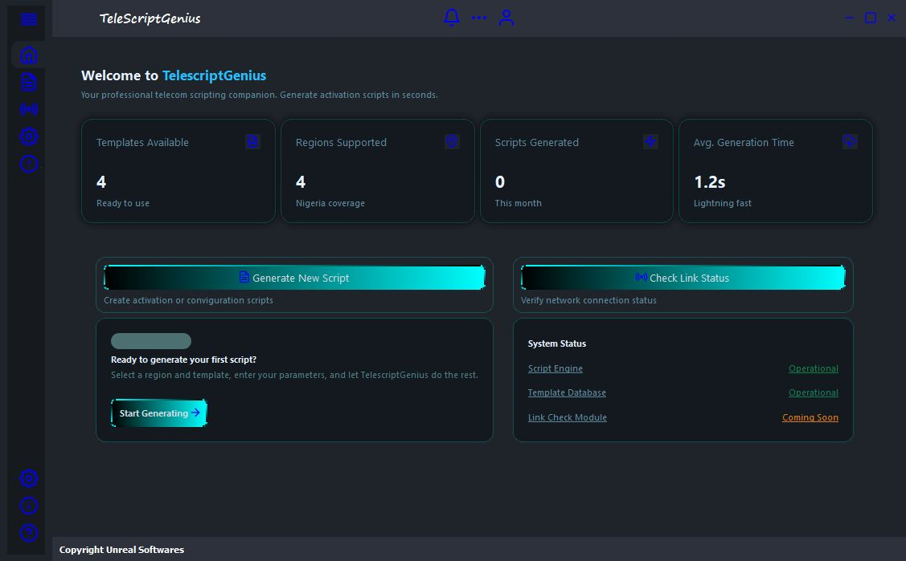

# TelescriptGenius

**TelescriptGenius** is a desktop application for telecom professionals, built with Python and PyQt5.  
It simplifies telecom script generation through an intuitive GUI, enabling faster, template-based creation of configuration scripts for network operations.


---

## Disclaimer

> **TelescriptGenius is an independent project and is not affiliated with any company or organization.  
> Any configuration examples or site identifiers are for demonstration purposes only and do not represent real operational data.**

---

---

## Problem

In telecom engineering workflows, engineers often need to generate repetitive configuration scripts for multiple network sites, clusters, and regions.

This process is:

- Time-consuming  
- Repetitive  
- Prone to human error  
- Difficult to scale manually  

---

## 🧠 Solution

TelescriptGenius automates and simplifies this workflow by providing a GUI-based script generation system.

It allows users to:

- Generate telecom scripts instantly using predefined templates  
- Manage multiple regions and configurations efficiently  
- Reduce manual errors in script creation  
- Automate cluster and site connection workflows  

---

## ✨ Features

- 🖥 GUI-based telecom script generator  
- ⚙ Multiple telecom template support  
- 📂 Directory and file management system  
- 🔗 Automated cluster and site connection generation  
- 🚀 Fast and efficient workflow for telecom engineers  
- 🧩 Designed for future expansion (link validation, additional tools, etc.)

---

## 🛠 Tech Stack

- Python  
- PyQt5 / PySide  
- File-based automation system  

---

## 📸 Demo




## Installation

1. Clone the repository:
   ```bash
   git clone https://github.com/fawazdevx/TeleScriptGenius.git
   ```
2. Install dependencies:
   ```bash
   pip install -r requirements.txt
   ```
3. Run the application:
   ```bash
   python main.py
   ```

---

## License

This project is licensed under a proprietary license. See [LICENSE](./LICENSE) for terms.

---

## Contact

For commercial or partnership inquiries, email: [oyebodefawaz2020@gmail.com]